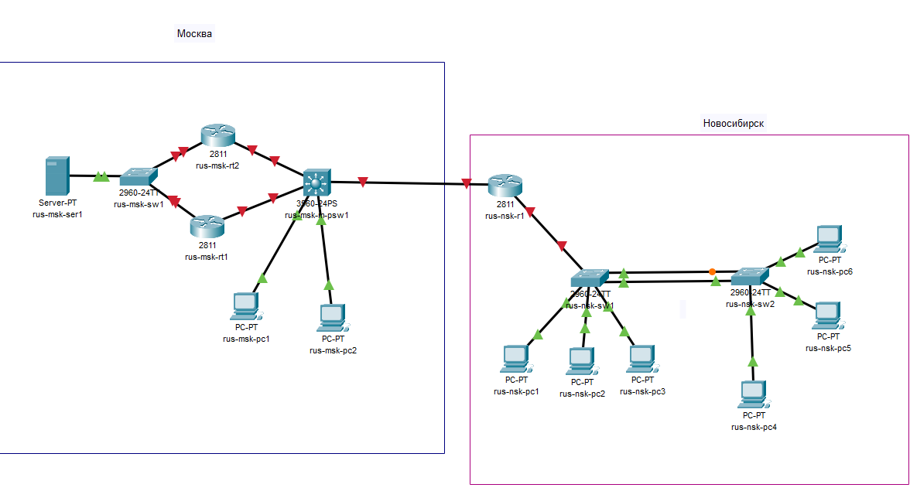

## Часть 1.
### Шаг 1. Создание топологии сети.


*Рис.1 Топология сети.*

### Шаг 2. Настройка banner MOTD.

#### Настраиваем на каждом роутере MOTD согласно заданию и выдаем hostname, согласно топологии.


*Рис.2 Настройка MOTD на rus-msk-rt0.*

####Такую же настройку, но с изменением имен проводим с остальными устройствами.


*Рис3. Настройка MOTD на rus-msk-rt1*


*Рис.4 Настройка MOTD на rus-nsk-rt0*

### Шаг 3. Новые имена устройств.

#### Москва

| Первичная | Измененная |
| --- | --- |
| server0 | rus-msk-serv1 |
| switch0 | rus-msk-sw1 |
| router0 | rus-msk-r1 |
| router1 | rus-msk-r2 |
| Multilayer switch1 | rus-msk-multisw1 |
| PC0 | rus-msk-pc1 |
| PC1 | rus-msk-pc2 |

#### Новосибирск

| Первичная | Измененная |
| --- | --- |
| router0 | rus-nsk-r1 |
| switch0 | rus-nsk-sw1 |
| switch1 | rus-nsk-sw2 |
| PC0 | rus-nsk-pc1 |
| PC1 | rus-nsk-pc2 |
| PC2 | rus-nsk-pc3 |
| PC3 | rus-nsk-pc4 |
| PC4 | rus-nsk-pc5 |
| PC5 | rus-nsk-pc6 |

*Таб.1 Новые имена устройств*

### Шаг 4. Выдача доменных имен согласно местоположению.

#### Москва

| Устройство | Домен |
| --- | --- |
| rus-msk-serv1 | msk.local |
| rus-msk-sw1 | msk.local |
| rus-msk-r1 | msk.local |
| rus-msk-r2 | msk.local |
| rus-msk-multisw1 | msk.local |
| rus-msk-pc1 | msk.local |
| rus-msk-pc2 | msk.local |

#### Новосибирск

| Устройство | Домен |
| --- | --- |
| rus-nsk-r1 | nsk.local |
| rus-nsk-sw1 | nsk.local |
| rus-nsk-sw2 | nsk.local |
| rus-nsk-pc1 | nsk.local |
| rus-nsk-pc2 | nsk.local |
| rus-nsk-pc3 | nsk.local |
| rus-nsk-pc4 | nsk.local |
| rus-nsk-pc5 | nsk.local |
| rus-nsk-pc6 | nsk.local |

*Таб.2 Доменные имена устройств*

### Шаг 5. Создание VLAN на коммутаторах в Новосибирске.

#### Создаем на rus-nsk-sw1 и rus-nsk-sw2 VLAN 2,3 и 4, не присваивая им имен.


*Рис.5 Создание VLAN без имен на rus-nsk-sw1*


*Рис.6 Создание VLAN без имен на rus-nsk-sw2*

### Шаг 6. Присвоение VLAN на интерфейсы.

#### Назначаем VLANы на интерфейсы согласно заданию.


*Рис.7 Присвоение VLAN на rus-nsk-sw1.*


*Рис.8 Присвоение VLAN на rus-nsk-sw2.*

### Шаг 7. Создание канала EtherChannel.

#### Необходимо создать канал EtherChannel 2-го уровня между коммутаторами в Новосибирске со следующими требованиями:

```
1. Использовать стандартный протокол для создания логической связи;
2. Коммутатор 0 долден являтся ответственным за инициирование согласования канала EtherChannel;
3. Изменить интерфейс агрегированного канала на транковый на обоих коммутаторах.
```


*Рис 9-11 Настройка EtherChannel на SW1*

#### Аналогично на SW2.


*Рис.12 Настройка EtherChannel на SW2*

### Шаг 8. Создания Management interface для VLAN 1.

#### Необходимо создать Management interface на SW1 используя:
```
1. VLAN 1;
2. IP: 1.0.0.50/8;
3. Шлюз: 1.0.0.1
```


*Рис.13 Настройка Management interface на SW1*

#### Аналогично создаем Management interface на SW1 используя:
```
1. VLAN 2;
2. IP: 2.0.0.50/8;
3. Шлюз: 2.0.0.1
```


*Рис. 14 Настройка Management interface на SW2*

### Шаг 10. Включение SSHv2 в Новосибирске.

#### Требования:
```
user = nsk
password = cisco
Только SSH
```


*Рис. 15 Настройка SSHv2 на SW1*

Точно также выполняем всю настройку на SW2.
```
conf t
username nsk secret cisco
crypto key generate rsa
1024
ip ssh version 2
line vty 0 15
login local
transport input ssh
exit
end
wr
```

### Шаг 11. Подключение F0/24 от SW1 к R1.

#### Необходимо подключить интерфейс f0/24 от sw1 к r1 в режиме trunk.


*Рис. 16 Включение режима trunk на f0/24*

### Шаг 12. Настройка MOTD на SW1 и SW2.


*Рис. 17 Настройка MOTD на rus-nsk-sw1*


*Рис. 18 Настройка MOTD на rus-nsk-sw2*

### Шаг 13. Настройка f0/2, f0/3, f0/4.

### Требования:
```
1.Fast forwarding;
2.Не принимать BPDU;
3.Отключить CDP;
4.Port Security;
5.За нарушение - состояние err-disable
```


*Рис 19 Настройка интерфейсов на SW1*

#### Точно такие же команды выполняем на SW2, не забывая сохранить изменения.

### Шаг 14. Защита консоли.


*Рис. 20 Защита консоли на SW1*

#### Идентично выполняем на SW2.

### Шаг 15. Убрать timeout exec для консоли SSH.

#### Выполнить на SW1 и SW2 следующие команды:
```
line console 0
exec-timeout 0 0
exit

line vty 0 15
exec-timeout 0 0
end
wr
```

### Шаг 16. Не прерывать ввод логам. Изменения буфера истории до 256 строк.

#### Выполнить на SW1 и SW2 команды:
```
line console 0
logging synchronous
exit
terminal history size 256
end
wr
```

## Часть 2

### Шаг 1. IP на F0/1 маршрутизатора R1


*Рис. 21 настройка f0/1 на R1*

### Шаг 2. Router-on-a-Stick для VLAN 1,2,3,4

#### Настройка VLAN 1


*Рис. 22 настройка f0/0.1*

#### Настройка VLAN 2


*Рис. 23 настройка f0/0.2*

#### Настройка VLAN 3


*Рис.24 настройка f0/0.3*

#### Настройка VLAN 4


*Рис. 25 настройка f0/0.4*

#### Включить физ. интерфейс


*Рис. 26 настройка f0/0*

### Шаг 3. DHCP исключения.


*Рис. 27. Некоторые настройки DHCP.*

#### Шаг 4. DHCP pool для VLAN 


*Рис.28 DHCP pool для VLAN2*


*Рис.29 DHCP pool для VLAN3*


*Рис.30 DHCP pool на VLAN4*

#### Шаг 5. Проверка на ПК.

#### Необходимо проверить корректность IP configuration на всех ПК в Новосибирске.


*Рис. 31 Итоговая конфигурация на PC0*


*Рис.32 Итоговая конфигурация на PC1*


*Рис.33 Итоговая конфигурация на PC2*

## Часть 3. 

### Шаг 1. Настройка имени и включение маршрутизации.

#### Настройка имени согласно топологии:


*Рис.34 Настройка имени на MLS*


*Рис.35 Включение маршрутизации на MLS.*

### Шаг 2. Создание и настройка портов доступа.


*Рис. 36 Создание VLAN 100 и VLAN 200*


*Рис 37. Назначение VLAN на соответствующие порты*

### Шаг 3. Настройка SVI интерфейсов.


*Рис.38 Назначение IP для VLAN 100 и 200*

### Шаг 4. Перевод портов в L3 порты.

#### Необходимо перевести порты: F0/1, F0/2 F0/3 в L3 порты.


*Рис. 39 Настройка F0/1*


*Рис. 40 Настройка F0/2*


*Рис. 41 Настройка F0/3*

### Шаг 5. Настройка ПК


*Рис.42 Настройка сети для PC0*


*Рис.43 Настройка сети для PC1*

## Часть 4.

### Шаг 1. Настройка IP на R2.


*Рис.44,45 настройка IP на R2*

### Шаг 2. Настройка IP на R3


*Рис. 46-47 настройка IP на R3*

### Проверка HSRP

#### На R2

*Рис.48*

#### На R3

*Рис.49*

### Тест отказоустойчивости

#### На R2 выключить f0/1

*Рис.50*

#### На R3

*Рис. 51*

### Часть 5.

#### Какие сети участвуют
1.0.0.0/8
2.0.0.0/8
3.0.0.0/8
4.0.0.0/8
10.0.0.0/8
11.0.0.0/8
12.0.0.0/8
40.40.40.0/24
100.0.0.0/8
200.0.0.0/24

#### R1-EIGRP

*рис.52*

#### R1-EIGRP

*рис.53*

#### R2-EIGRP

*рис 54*

#### RUS-MSK-MULTISW1:


*Рис. 55*

### Шаг 2 - Проверка с помощью SSH.


*Рис.55 SSH на sw1*

Подключение SSH с сервера на sw2:


*Рис.56 SSH на sw2*

## Шаг 3 - Пинг с сервера:


*Рис.57 Пинг с сервера*

# Часть 6
## Шаг 1 - Настройка доступа по SSH к SW1 и SW2 

rus-nsk-sw1:


*Рис.58 Настройка доступа SSH на sw1*

rus-nsk-sw2:


*Рис.59 Настройка доступа SSH на sw2*

## Шаг 2 - Настройка доступ к веб-серверу

rus-nsk-r1:


*Рис.60 Настройка доступ к веб-серверу*

## Шаг 3 - Запрет ответа на ping R1 и R2 в Москве

rus-msk-r1:


*Рис.61 Запрет ответа на ping на R1*

rus-msk-r2:


*Рис.62 Запрет ответа на ping на R2*

# Часть 7
## Шаг 1 - Создание loopback-интерфейса на R1

rus-nsk-r1:


*Рис.63 Создание loopback-интерфейса на R1*

## Шаг 2 - Настройка loopback на R2 в Москве

rus-msk-r2:


*Рис.64 Настройка loopback на R2*

## Шаг 3 - Настройка анонсирования Loopback-интерфейса через RIPv2

rus-nsk-r1:


*Рис.65 Настройка анонсирования loopback-интерфейса*

rus-msk-r2:


*Рис.66 Настройка анонсирования loopback-интерфейса*

## Шаг 4 - Ограничение работы RIPv2

rus-msk-r1:


*Рис.67 Ограничение RIPv2 на R1 в Мск*

rus-msk-multisw1:


*Рис.68 Ограничение RIPv2 на MLS в Мск*

## Шаг 5 - Настройка IP-адресации туннеля 

rus-nsk-r1:


*Рис.69 Настройка IP-адресации туннеля на R1*

rus-msk-r2:


*Рис.70 Настройка IP-адресации туннеля на R2*

## Шаг 6 - Проверка


*Рис.71 Проверка loopback-интерфейса*

# Часть 8
## Шаг 1 - Настройка NTP-сервера и Syslog-сервера
rus-nsk-r1:


*Рис.72 Настройка NTP-сервера и Syslog-сервера*

rus-msk-r1:


*Рис.73 Настройка NTP-сервера и Syslog-сервера*

rus-msk-r2:


*Рис.74 Настройка NTP-сервера и Syslog-сервера*

## Шаг 2 - Включение SNMP на R1 и R2 в Мск
rus-msk-r1:


*Рис.75 Включение SNMP на R1 в Мск*

rus-msk-r2


*Рис.76 Включение SNMP на R2 в Мск*

## Шаг 3 - Настройка AAA и Telnet на R2 в Мск
rus-msk-r2:


*Рис.77 Настройка AAA и Telnet на R2 в Мск*

## Шаг 4 - Настройка FTP на R1 в Мск
rus-msk-r1:


*Рис.78 Настройка FTP на R1 в Мск*

## Шаг 5 - Отправка конфигурации R1 на сервер, с помощью FTP
rus-msk-r1:


*Рис.79 Отправка конфигурации*

## Шаг 6 - Отправка конфигурации R2 на сервер, с помощью TFTP
rus-msk-r2:


*Рис.80 Отправка конфигурации*

## Шаг 7 - Проверка на использование команд boot system в R2 в Мск
rus-msk-r2:


*Рис.81 Проверка на использование команд boot system в R2 в Мск*

Команда ничего не выдаёт, значит команд boot system нет

## Шаг 8 - Проверка подключения к R2 в Мск по telnet
Для начала создадим пользователя Standby на R2.

rus-msk-r2:


*Рис.82 Создание пользователя Standby*

Для работы на R2 по telnet нужно поставить пароль для перехода в привилегированный режим.

rus-msk-r2:


*Рис.83 Пароль для привилегированного режима.*

Дальше можем подключаться по telnet.

rus-msk-r1:


*Рис.84 Подключение к R2 по telnet*

## Шаг 9 - Изменение локального имени пользователя в R2
Для начала вводим команду для игнорирования конфигурации при загрузке. Вся настройка происходит на rus-msk-r2.


*Рис.85 Ввод команды для игнорирования конфигурации при загрузке.*

Дальше предложит войти в диалоговое окно начальной настройки, нужно отказаться.


*Рис.86 Отказ от входа в диалоговое окно начальной настройки*

Затем загружаем старую конфигурацию и изменяем имя пользователя 


*Рис.87 загрузка старой конфигурации*

Возвращаем значение конфигурационного регистра.


*Рис.88 Возвращение значения конфигурационного регистра.*
